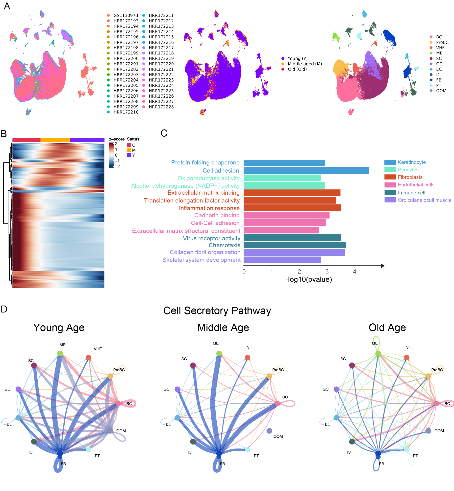
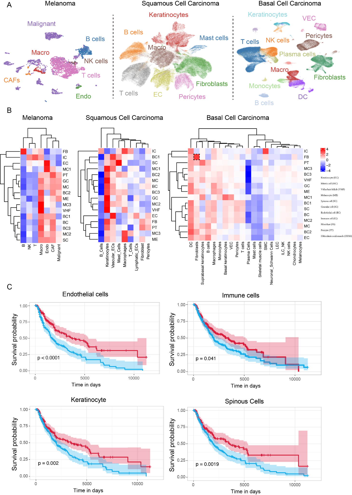
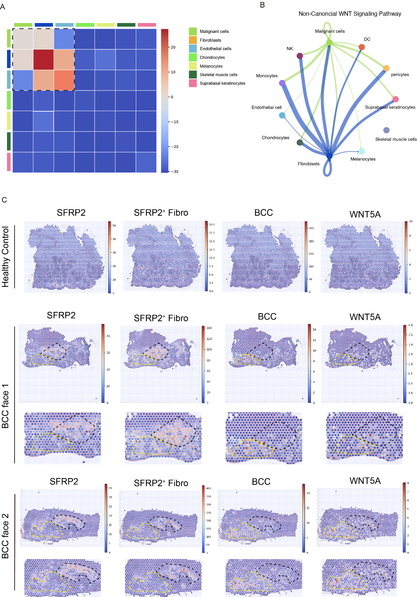
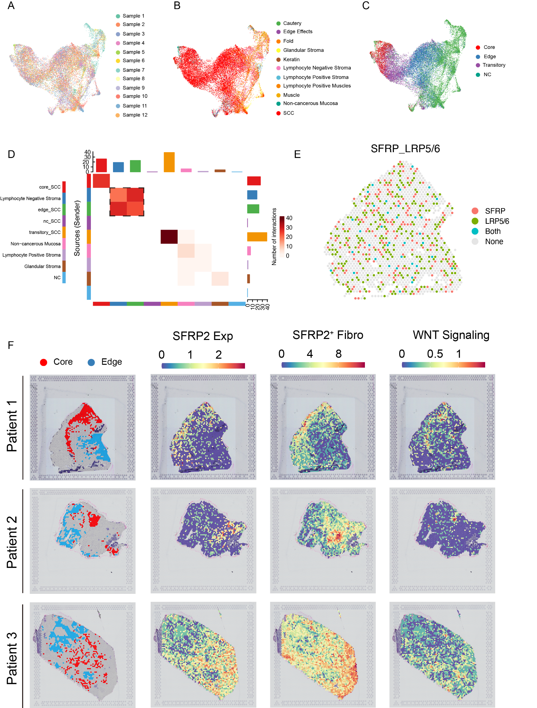
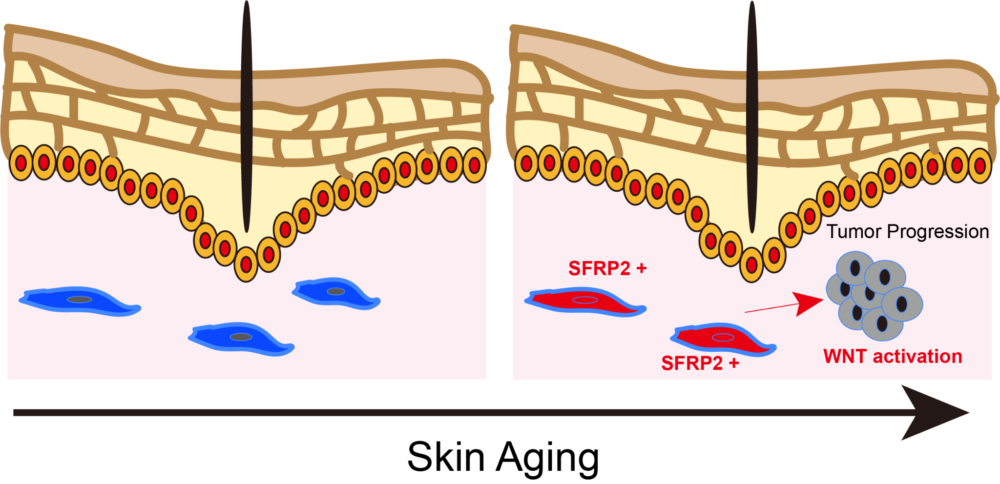
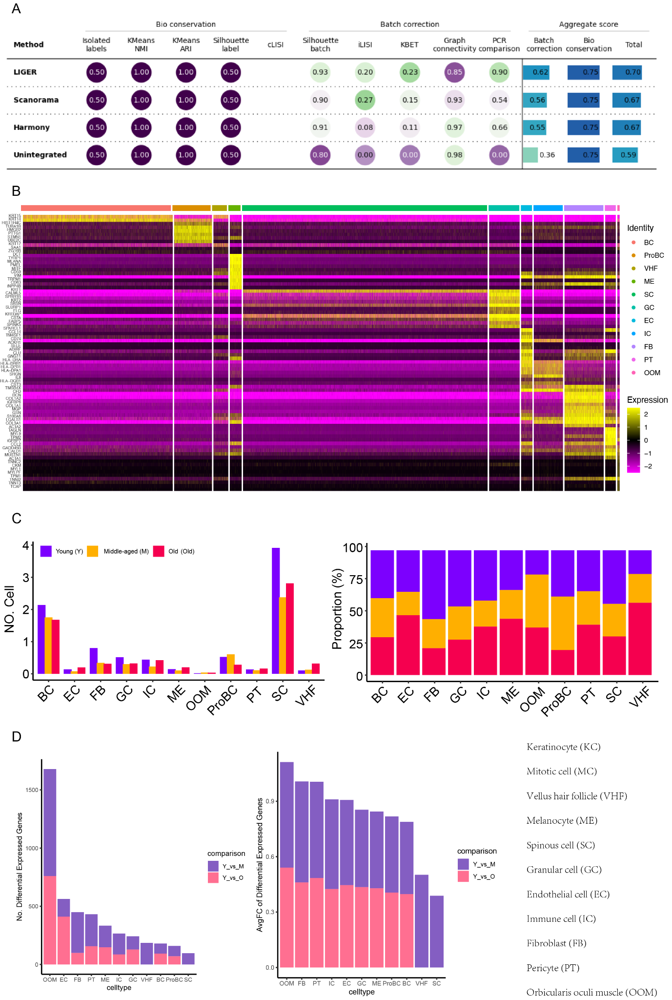

# An Atlas of Aging-Associated Programs in Human Skin and Skin Cancers

> Reproducible pipeline for downloading, processing, integrating, and analyzing scRNA‑seq & spatial transcriptomics datasets from healthy skin and skin cancers (melanoma, SCC, BCC). Includes benchmarking of integration methods, Visium processing, cell-type annotation, aging gene signatures, trajectories, ligand–receptor analysis, and survival associations.

## Repository structure

```
skin-aging-atlas/
├── configs/
├── data/
├── docs/
├── envs/
├── scripts/
│   ├── bash/
│   ├── python/
│   └── R/
├── results/
├── figures/
└── .github/workflows/
```

## Environments

```bash
mamba env create -f envs/python.yml
mamba env create -f envs/r.yml
```

## Data acquisition

- Healthy skin: GSE130973 (GEO), HRA000395 (GSA)
- Melanoma: GSE115978 (GEO)
- SCC: scRNA‑seq GSE218170; Visium GSE208253 (GEO)
- BCC: scRNA‑seq E-MTAB-13085; Visium E-MTAB-13084 (ArrayExpress)

Download helpers are in `scripts/bash/`:
- `download_sra.sh` (sratoolkit/Aspera)
- `cellranger_count.sh` and `spaceranger_count.sh` (wrappers; edit paths)

## Integration & benchmarking

Compute Harmony, Scanorama, and LIGER embeddings and evaluate with scIB (iLISI, kBET, Silhouette, Graph connectivity):

```bash
conda activate skin-aging-atlas-py
python scripts/python/integration_benchmark.py --input h5ad_paths.json --outdir results/integration_benchmark
```

## R analysis scripts

- QC/annotation: `scripts/R/seurat_annotation.R`
- Visium: `scripts/R/visium_processing.R`
- Aging signature: `scripts/R/aging_signature_build_validate.R`
- Trajectories: `scripts/R/monocle3_trajectory.R`
- CellChat: `scripts/R/cellchat_analysis.R`
- Survival (TCGA): `scripts/R/tcga_survival.R`

## Reproducing the main results

1. Download & preprocess (bash).
2. Integrate & score (python).
3. Annotate (R/Seurat).
4. Visium processing (R).
5. Aging signature build & validation (R).
6. Trajectory (R/Monocle3).
7. CellChat (R).
8. Survival association (R).

## Publish to GitHub & Pages

1. Create a repo and enable **Pages** (from `/docs`).  
2. Push everything:

```bash
bash scripts/bash/init_repo.sh https://github.com/<you>/skin-aging-atlas.git
```

Then visit `https://<you>.github.io/skin-aging-atlas/`.

## Figures (examples)
- 
- 
- 
- 
- 
- 
