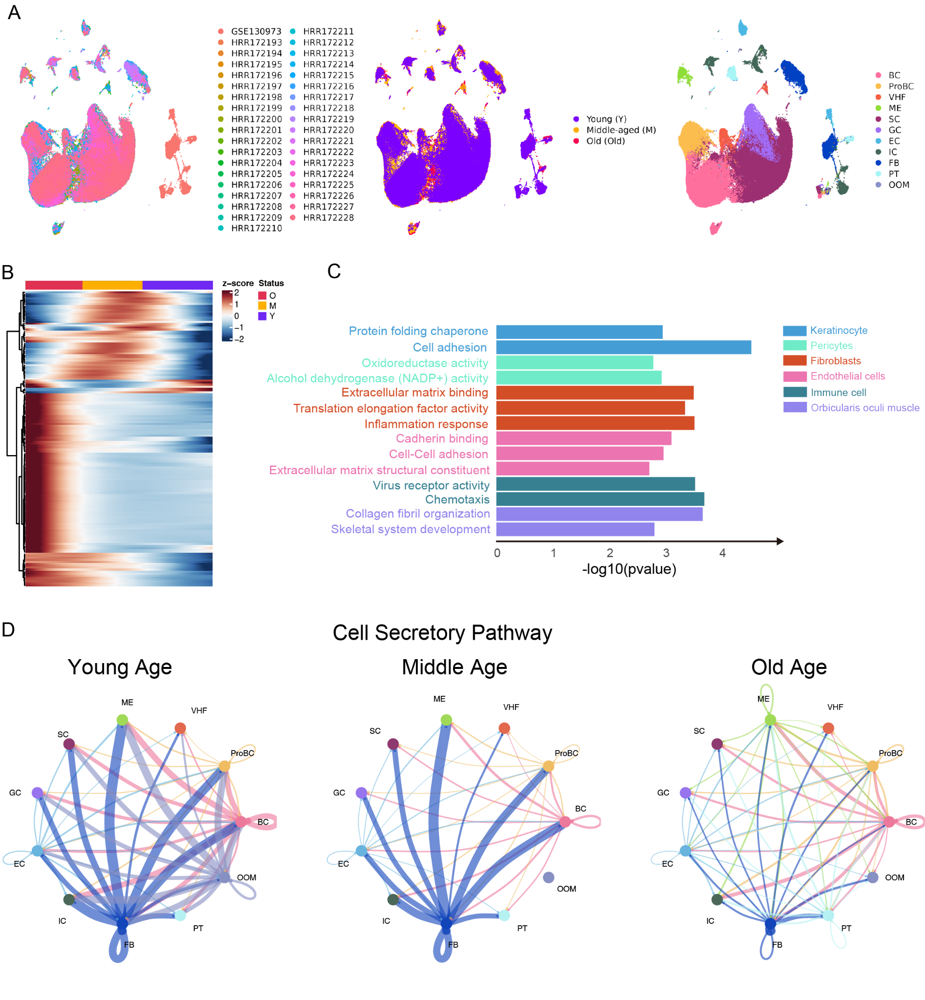
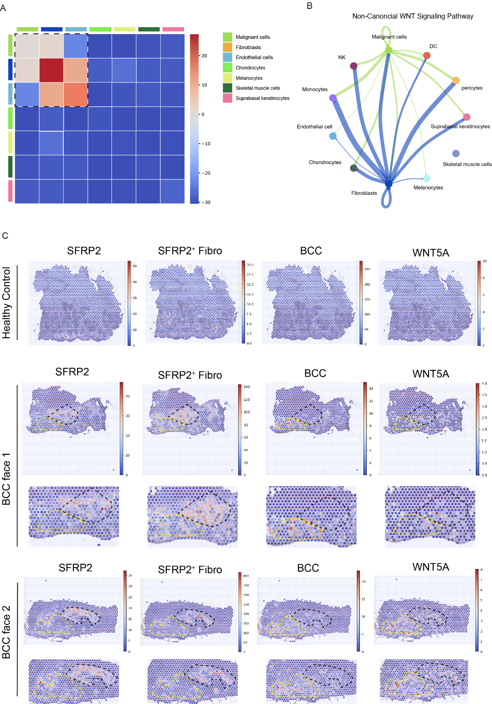
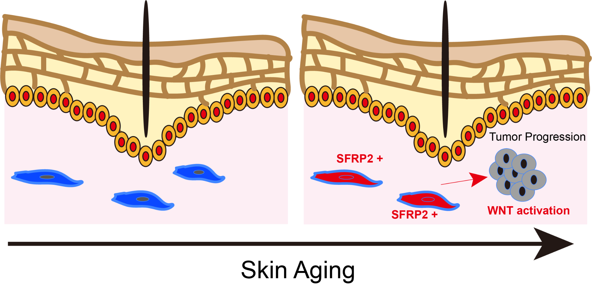

# Skin Aging Atlas – Reproducible Analysis

This site documents the pipeline for integrating single-cell and spatial transcriptomics of human skin across age and cancer types.

## Workflow
1. Download data (GEO/GSA/ArrayExpress)
2. Preprocess & align (CellRanger/SpaceRanger)
3. Integration + scIB benchmarking (Harmony / Scanorama / LIGER)
4. Annotation (Seurat) and Visium processing
5. Aging gene signatures (construction + validation)
6. Pseudotime trajectories (Monocle3)
7. Ligand–receptor interactions (CellChat)
8. Prognostic analysis (TCGA; Kaplan–Meier)

